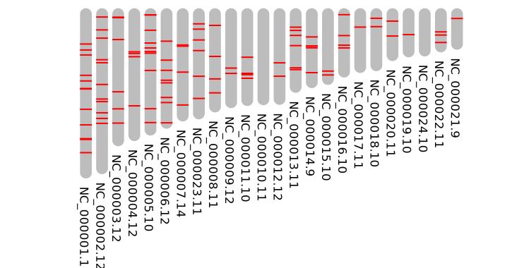
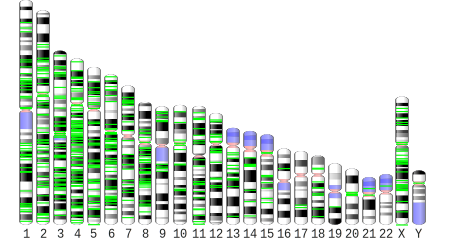
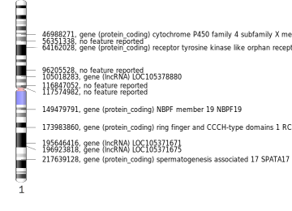
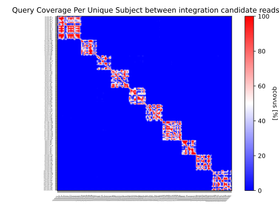
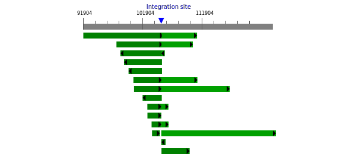
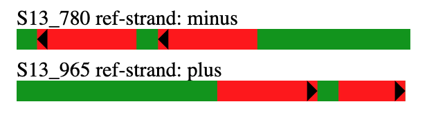

# Integration_locator
Integration_locator a python package for the detection of sequence integrations 
in genomes with long-read sequencing data.
  !This is a non-functional preview branch! 
  The fully functional version will soon be released.

## Table of Contents
- [About IntLoc](#intro)
- [Installation](#install)
- [Quick Start](#quick)
- [Usage](#usage)
  - [Command Line Use](#cli)
  - [Graphical User Interface](#gui)
  - [Auxiliary Tools](#aux)
- [Results Representations](#results)
  - [Customizing Figures](#figs)
  - [Species specific Ideograms](#specs)
    - [Intra-mode Ideograms](#intra)
- [Commmand line Options](#options)
- [IntLoc Structure](#flowchart)
- [Dependencies](#depend)

## <a name="intro"></a>About
Integration_locator is a python package intended to serve all your needs regarding
 the detection, localization and quantification of all types of sequence integrations
 in any genome. Unlike other tools or custom scripts IntLoc offers operation
 modes that allow the detection of integrations in many different settings and under
 various circumstances. For instance you can toggle between a polyclonal or
 the monoclonal mode (standard setting), depending if you are using DNA prepared from a heterogenous mixture
 of cells or DNA from a clonal population, where all cells are expected to carry the
 same set of integrations. Furthermore, you can select between transgenic and intra
 genic mode. The intragenic mode will report all integrations that are present in your sequencing reads
 and the reference, which reference integrations are not in your sequencing reads and all novel integration
 sites that can be found in the reads, but are not in the reference. Transgenic mode (standard setting)
 will find only transgenic integrations previously not present in the reference, but
 will warn you if your integrating sequence shares enough similarity with the reference
 to cause false positive results and offers assistance to omit such problems.
 The results output includes publication ready figures in variety of styles and comprehensives reports.
 In addition Intloc contains a number of auxilliary functions and modules associated with 
 genomic integrations, including generation of genomes with simulated integrations
 and functions for testing, clustering of reads and thourough evaluation of int-sites
 for the elimination of false positves. IntLoc comes with a graphical user interface
 to allow convenient use also for users who don't feel so comfortable with command line
 interfaces.
 Integration_locator has been tested successfully on MacOS, Linux and Windows.

## <a name="install"></a>Installation
The recommended way to install Integration_locator is via `conda`

    conda create -n intloc -c bioconda intloc

You can also install via the python package manager `pip`

    pip install intloc

A containerized version is also available through `Docker`

    some docker container

Alternatively you can just clone this repository and install dependencies manually.
After cloning the repo into your chosen destination path, to start intloc type:

  cd Integration_locator
  cd intloc
  python integration_locator.py <required parameters> <optional parameters>


  
If you run want to run intloc under `Windows` the container version is probably  
your best option, since the `minimap2` dependency can not easily be installed 
in windows using conda or pip. Even without this dependency, the core functions
of IntLoc will still work properly, but some additional functionalities would 
not be available.

## <a name="quick"></a>QuickStart

    conda activate intloc

    python intloc -c /path/to/integrating/sequence -f /path/to/seq/reads -g /path/to/ref/genome -o /path/to/outdir

## <a name="usage"></a>Usage

### <a name="cli"></a>Command line use

Intloc requires 4 essential pieces of information to carry out its task:
- a fasta/fastq file containing (only) the integrating sequence
- the sequencing reads (in fasta of fastq format)
- a reference genome
- a directory for output

Sequencing reads can either be provided as a single fasta/q file (-f) or as
path to a directory containing multiple fasta/q files.
For the reference genome, if you already have a local copy, just provide the path
 to the file (-g), or use the -w argument to download the genome from ncbi (e.g. -w "Homo sapiens").

    python intloc -c /path/to/integrating/sequence -f /path/to/seq/read_file -g /path/to/ref/genome -o /path/to/outdir 

Depending on the environment you are in or how you have your python installations 
managed, you may have to use `python3` instead of `python` to start the right interpreter.

    python3 intloc -c /path/to/integrating/sequence -d /path/to/seq/read_dir -w "Mus musculus" -o /path/to/outdir

Intloc will generate a generic ideogram showing the location of the integrations
for any reference genome provided with contigs sorted for size.  

<!-- <p align="center">
  
</p> -->
  

However, for a number of important model organisms ([list](#specs)) generation of more polished 
and interactive ideograms can be triggered, using the `--spec` argument. This
will also enable determination of genomic features around the integration site.

    python intloc --spec "Homo sapiens" -c /int/sequence -f /seq/reads -g /ref/genome -o /outdir 

The most common species synonyms are also accepted (e.g. human for Homo sapiens or mouse instead of Mus musculus etc.). 

<!--    -->
<p align="center">
  
</p>
Follow this link and select Raw to view the interactive version; hover over int-sites for information:

[Interactive_human_Ideogram](images/ideogram_human_100xints_standard.svg)

Moreover, Intloc generates single annotated chromosome figures of all chromosomes
 bearing integrations if the `--spec` argument is set.

<!--    -->
<p align="center">
  
</p>  

By default an integration site has to be supported by a minimum of 3 sequencing 
reads in order to be scored. Multiple mechanism ensure that even at higher cover
ages this realteively low threshold does not lead to false positive results, whi
le maintaining high sensitivity. However, if you are working with very low cover
age data (<5x), you may want to reduce this cutoff using the --min_read_supp par
ameter. Alternatively, if you employed target enrichment and expect tens of thou
sand reads per site, it may also make sense to increase this value.

    python intloc --min_read_supp 1 -c /int/sequence -f /seq/reads -g /ref/genome -o /outdir 

One of the precautions intloc employs to exclude false positive results is to co
mpare the identity of detected integration sites among each other and to search 
the genome for the next or second best integration site for each potential integ
ration site. Depending on the strength and type of support, overlap as well as p
ossible misalignments or misassignemtns, integration sites might be merged or di
scarded. The degree of unequivocality of each passing site can be judged from va
lues that inform about the quality of read-alignment to the chosen site and iden
tity to the next best potential similar location if existing (SSBR and IMR values). 

As an additional function IntLoc offers all-vs-all clustering (--ava_clust) of integration can
didate reads to visualize the evidence for different intergration sites. This vi
ew can act as a nice confirmation and complement the results from genome targete
ted alignments. Read clustering can take quiet a bit of time for high numbers of
candidate reads, therefore it is not recommended for datasets with excessive coverage
(>50x) as in enrichment based approaches and becomes less informative for high n
umbers of int-sites (>20).



Intloc also generates views of the mapping position of integration candidate reads at the integration site. 
Split alignments of integration reads that span the whole integration and flanking genomic 
sequences on both sides are shown in the same row with the second part of the split alignment
 colored in a lighter shade of green.   

<!--    -->
<p align="center">
  
</p>

Checkout the interactive html here:
[Interactive candidate read mapping fig](http://htmlpreview.github.io/?https://github.com/simakro/Integration_locator/blob/min-dist_recursive_merging/images/Yeast_map_fig_NC_001135.5_105077.html)

For reads containing more information than a simple integration event, an additional 
figure is prepared, showing the position and direction of individual aligning segments.

<!--  -->
<p align="center">
  
</p>

The central graphs and tables depicting the results of a run are collected and 
presented in a html summary report along with information regarding the run.
Intloc also prepares a minimalistic pdf version of the summary report.

View example summary report here:
[Example html summary report](http://htmlpreview.github.io/?https://github.com/simakro/Integration_locator/blob/min-dist_recursive_merging/images/Integration_summary_report_Yeast_with_ava-clust_teal.html)


Fasta files containing the bundled reads supporting each called integration site
are saved in `/outdir/intloc_out_{date}_{time}/reads_by_category`.

Tabular information about integrations, feature, reads etc. are also stored in 
csv and txt format under `/outdir/intloc_out_{date}_{time}/reports`.

### <a name="gui"></a>Graphical User Interface
Start the GUI by opening Integration_locator/intloc in a terminal and running this command:

    python intloc_gui.py

<p align="center">
  
</p>

### <a name="aux"></a>Auxiliary Tools
- il_integrator
- all-vs-all read clustering
- testing integration locator
- downloading reference genomes
- integrating additional species (prune feature table, )

## <a name="results"></a>Results Representations

### <a name="specs"></a>Species specific Ideograms
Currently IntLoc includes creation of species specific ideograms and reporting 
of genomic features for the following species:

- Homo Sapiens / human
- Mus musculus / mouse
- Rattus norvegicus / rat
- Saccharomyces cerevisiae / yeast
- Drosophila melanogster / drosophila
- Caenorhabditis elegans / Celegans
- Arabidopsis thaliana / arabidopsis
- Danio rerio / zebrafish

Additional species can be added upon request.

#### <a name="figs"></a>Customized Figures
Follow this link to view a gallery of the different types of ideograms (and other figs) provided by IntLoc:
[IntLoc-Ideogram-gallery](http://htmlpreview.github.io/?https://github.com/simakro/Integration_locator/blob/min-dist_recursive_merging/images/IntLoc-Ideogram-gallery.html)

#### <a name="intra"></a>Intra-mode Ideograms
In intra mode integration locator generates two separate full ideograms to show
 different classes of integrations.
  1. Integrations already present in the reference genome (preexisting ints). 
  2. Integrations present in the sequencing data but not the reference (novel ints)

For preexisting integrations sites (1.), ones that are confirmed by the sequencing data
 are distinguished by color (green) from integrations, which are not supported by reads (blue).

<p></p>
&nbsp; 
As an example see here identification of LINE1 elements in a human fibroblast cell line.
Ideogram showing location of all LINE1 integrations present in the human reference genome
(also referred to preexisting integrations here). Integrations shown in green have been confirmed
to be present in the fibroblast cell line by sequencing. Integrations colored in blue
 were not supported by sequencing reads:
<p align="center">
  
</p>

<p></p>
&nbsp;
<p></p>
&nbsp;
                   
Ideogram showing novel LINE1 integrations in the human fibroblast cell-line:
<p align="center">
  
</p>

<p></p>
&nbsp;

## <a name="flowchart"></a>IntLoc Structure
Follow this link to view a flowchart of the program structure of IntLoc standard-mode:
[Click here to view a flowchart with a rough representation of IntLoc Program structure](images/IntLoc-FLowChart_20230201.png)

## <a name="options"></a>Command Line Options
```sh
usage: integration_locator.py [-h] -c CONSTRUCT -o OUTDIR (-f READS_FILE | -d READS_DIR) (-g GENOME | -w DWNL_GENOME) 
                              [--spec SPECIES] [--min_read_supp MIN_SUPP] [--ava_clust] 
                              [--req_int_cont RIC] [--cov COVERAGE] [--verbosity VERBOSITY] [--file_check CHECK_READS] 
                              [--include_Nx NX] [--bait BAIT] [--seq_tec SEQ_TEC] [--min_dist_ints MIN_DIST_INTS]
                              [--untrimmed UNTRIMMED] [--polyclonal] [--intra] [--map_qual MAP_QUAL] [--cleanup]
                              [--skip_eval] [--quick] [--int_len INT_LEN] [--cores CORES] [--gene_dens] 
                              [--feat_dens FEAT_DENS] [--color_ints COLOR_INTS]

Integration locator detects the number and location of integrations of transgenic constructs
 or other inserted DNA sequences within a genome using long-read sequencing data.

optional arguments:
  -h, --help            show this help message and exit

Required arguments:
  -c CONSTRUCT, --construct CONSTRUCT
                        Path to fasta file containing the sequence of the integrating construct
  -o OUTDIR, --outdir OUTDIR
                        Path for output directory
  -f READS_FILE, --reads_file READS_FILE
                        Path to a single fasta/q file containing all sequencing reads
  -d READS_DIR, --reads_dir READS_DIR
                        Path to a directory containing multiple fasta/q files. Not recursive, subdirectories will be ignored. (mutually exclusive with -f/--reads_file)
  -g GENOME, --genome GENOME
                        Path to reference genome
  -w DWNL_GENOME, --dwnl_genome DWNL_GENOME
                        Specify a species for download of latest assembly (mutually exclusive with -g/--genome)

Optional arguments:
  --spec SPECIES        Select species (e.g. "human") to enable output of species specific ideogram and annotations
  --min_read_supp MIN_SUPP
                        Set minimum read support for integration validation [3]
  --ava_clust           Cluster reads based on all-vs-all alignment. Comparison of read-clusters to integration-sites identified by alignment of reads to the reference
                        genome may assist identification of potential duplicates that could arise from integration into highly repetetive genomic loci.
  --req_int_cont RIC    Only include sequencing reads containing at least x% of the integrating sequence as candidates for the detection of integration sites.
                        [default=20]
  --cov COVERAGE        Experimental. For whole genome sequencing data an approximate coverage value may be supplied as integer or floating point number through this
                        argument. This will be used to calculate the minimum read support for integration validation. Assumes relatively homogenous coverage (+/- 50%) and
                        diploidy. Only recommended for cov > 15x. For data with uncertain or highly in- homogenous coverage, such as data generated using target-
                        enrichment strategies, adaptive sampling or amplicon-sequencing, as well as for very low coverage WGS data, use the --min_read_supp arg to adjust
                        the minimum required read support to an appropriate value manually. [default=None]
  --verbosity VERBOSITY
                        Adjust level of output to the terminal
  --file_check CHECK_READS
                        Adjust thoroughness of file-check; quick/extensive [quick]
  --include_Nx NX       Choose cutoff for contigs to be included in figures in graphical report. Contigs comprising at least x percent of bases in RefGenome [98] will be
                        included. This parameter can be helpful to avoid graphs becoming overcrowded when working with reference genomes that contain large amounts of
                        alternative loci or a high number of miniscule unplaced contigs. Don\'t worry, this applies only to the figures 1-3 in the pdf-report. Thus, no
                        sequences will be ignored during integration search, i.e. there is no risk of missing out on integration sites. Species specific ideogram is not
                        affected.
  --bait BAIT           This argument can be supplied in addition to the construct/-c argument. It is required if the integration construct shares partial similarity with
                        the reference sequence when intloc is not run in intramode (--intra argument). Intloc will inform you if the use of a bait sequence is necessary.
                        Provide the path to a fasta file containing only part of the integrating construct as bait for identification of integration evidence reads. The
                        bait sequence must not share similarity with reference. [False]
  --seq_tec SEQ_TEC     Specify (long-read) sequencing technology (ont/pb). [default='ont']
  --min_dist_ints MIN_DIST_INTS
                        Sets the minimimun distance in bp that is required in order to count integrations on the same DNA molecule as separate entities or as part of a
                        single (potentially complex) integration event. [default=10000]
  --untrimmed UNTRIMMED
                        If you are using untrimmed raw-reads as input, you can provide the expected lengths of sequencing adapters + barcodes (if used) at the ends of
                        each read via this parameter. [default=0]
  --polyclonal          Use this flag to set min_read_supp=1, prevent merging of int-sites that are spaced less than min_dist_ints from each other and prevent exclusion
                        of sites that share extensive similarity and overlap. [default=False]
  --intra               Intra-mode allows to find pre-existing as well as newly occuring integrations of a provided query sequence in the genome. For example this mode
                        can be used to identify the locations of LINEs in a genome. [default=False]
  --map_qual MAP_QUAL   Specify cutoff for required completeness (not identity) of read mappings to the reference. If the genome of your sample does not deviate
                        significantly from the reference, this value should be 3-10 % lower than the accuracy of the sequencing reads. Increasing the tolerance by
                        lowering this value may help to reveal integrations in genomic locations of your sample that significantly deviate from the reference. However, it
                        may increase the risk for false positives as well. [default=90]
  --cleanup             Deactivate cleanup of temporary and auxiliary files. Relevant for debugging only.
  --skip_eval           Skip evaluation module. Evaluation for the identification of false positives can significantly increase the runtime (in dependence of genome size
                        and number of integrations). You can skip it when in a hurry and do not fear no FPs.
  --quick               Quick and dirty integration detection (using only minimap2) without thorough evaluation of sites. Often sufficient for easy cases (smaller non-
                        repetetive genomes, low number of integrations), but typicallyproduces poorer results in more demanding cases (large complex genomes, high number
                        of integrations) than standard mode.Not compatible with following arguments: --read_dir, --ava_clust
  --int_len INT_LEN     Manually set the expected length of integrations. For WGS data this is not required nor recommended, since IntLoc automatically determines the
                        lengths of integrations in the genome. However, this parameter can be helpful when only using part of the integration as bait, or when using
                        enrichment methods (e.g. Cas9) that always result in truncated integration sequences in the reads. [default=False]
  --cores CORES         Specify number of cores to use. Intloc by default attempts to run parallelized tasks on all but two of the cores available on the current machine
                        (e.g. using 6 of 8 available cpu cores).
  --gene_dens           Derive ideograms with gene-density information.
  --feat_dens FEAT_DENS
                        Derive ideograms with feature-density information. A feature class and subclass have to be provided separated by a comma. (--feat_dens
                        gene,protein_coding reproduces the function of the --gene_dens flag)
  --color_ints COLOR_INTS
                        Specify color of int labels in figures. Possible values: green, blue, cyan, magenta, yellow, lime, olive, orange, pink, purple, teal, violet
                        [default=\'lime\']
```

## <a name="depend"></a>Requirements/Dependencies

Python dependencies
- Python 3.x
- svglib
- reportlab
- pillow
- scipy>=1.5
- matplotlib
- gooey
- pandas

Non-Python dependencies (not all essential for all use cases)
- ncbi-blast-2.x
- minimap2 >=2.16
- samtools